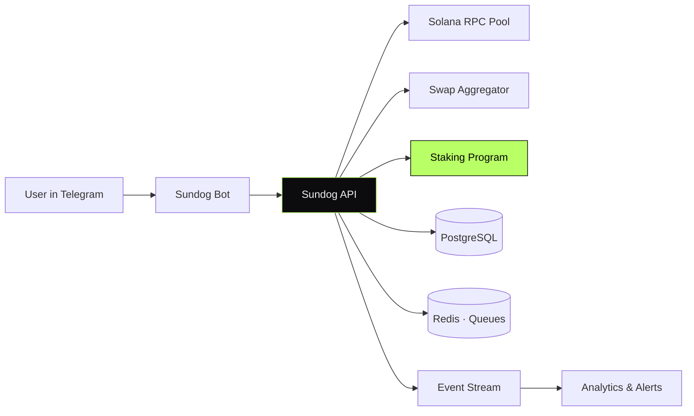

<div align="center">

```
   ███████╗██╗   ██╗███╗   ██╗██████╗  ██████╗  ██████╗
   ██╔════╝██║   ██║████╗  ██║██╔══██╗██╔═══██╗██╔════╝
   ███████╗██║   ██║██╔██╗ ██║██║  ██║██║   ██║██║  ███╗
   ╚════██║██║   ██║██║╚██╗██║██║  ██║██║   ██║██║   ██║
   ███████║╚██████╔╝██║ ╚████║██████╔╝╚██████╔╝╚██████╔╝
   ╚══════╝ ╚═════╝ ╚═╝  ╚═══╝╚═════╝  ╚═════╝  ╚═════╝
```

# Sundog — Solana Trading Product (Hype Cycle)

#### Telegram-native trading on Solana.
#### Bot UX, staking, indexer, analytics — stress-tested by real volume.

[](#)
[](#)
[](#)
[](#)

</div>

---

> **TL;DR** — A Telegram-native Solana trading product I led from architecture to
> production. Users discover, buy, sell, and stake tokens without leaving Telegram.
> Hit a real hype cycle and held under peak load.

---

## Overview

Sundog is a Telegram-native trading product on Solana. Users discover, buy,
sell, and stake tokens entirely inside Telegram. The product caught a hype
cycle and was stress-tested by real on-chain volume during peak hours.

The system spans a Telegram bot, an API service, a custodial routing layer,
a Solana on-chain staking program, and an analytics pipeline.

> This repository documents the system at the **architectural level**.
> Implementation code is private.

---

## My Role

> **Lead Engineer.** Architectural ownership, technical direction, on-call.

- Bot UX and conversational state-machine design
- Backend services (auth, quote routing, position tracking, custody)
- Solana staking program integration and reward accounting
- Analytics pipeline — events → metrics → dashboards
- Reliability under peak load (queue back-pressure, RPC failover)

---

## Architecture



---

## System Components

| Component | Responsibility | Stack |
|---|---|---|
| **Telegram Bot** | Conversational trading UX | Telegraf · TypeScript |
| **Sundog API** | Quotes, orders, positions, custody routing | NestJS · TypeScript |
| **Staking Frontend** | Solana staking dApp | Next.js · `@solana/wallet-adapter` |
| **Indexer** | On-chain event projection | Node.js · Solana web3.js |
| **Analytic Bot** | Operational metrics, alerts | Node.js · Telegraf |

---

## Capabilities

- **One-message trading** — full swap flow without leaving Telegram
- **Inline portfolio** — positions, PnL, unrealised gains rendered inline
- **Solana staking** — deposit, withdraw, claim with on-chain accounting
- **Resilient RPC** — multi-provider rotation with health scoring
- **Live analytics** — funnel, swap volume, retention dashboards

---

## Architectural Decisions & Tradeoffs

### 1. RPC pool with health scoring, not a single provider

Solana RPC providers degrade unpredictably. The API talks to a **pool**
of providers, each with a rolling latency/error score; degraded providers
are cooled down automatically. Result: the bot stays responsive when any
single provider gets flaky.

### 2. Idempotent swap pipeline

Each swap is a **durable job** with a server-side nonce. Retries are safe.
A swap can be observed, replayed, and audited end-to-end.

### 3. Conversational state machine, not flags

The bot UX is a **deterministic state graph** — each user has a current
state and a set of valid transitions. This eliminated a class of "bot is
stuck" bugs that would normally take hours to debug.

### 4. Back-pressure queues over rate-limiting

Under peak load the bot did not reject users — it queued them and degraded
gracefully. Faster than rebuilding once a hype cycle ends.

---

## Engineering Invariants

- **Never** trust a single RPC for confirmation
- **Never** mutate user balance outside a durable job
- **Never** prompt for a signature without showing the exact effect
- **Never** lose a swap intent — every intent is persisted before it touches chain

---

## Related Public Documents

- [`solana-pumpfun-backend`](https://github.com/eldardzh/solana-pumpfun-backend) — Solana backend patterns
- [`market-making-infra`](https://github.com/eldardzh/market-making-infra) — companion MM infra
- [`telegram-bots-suite`](https://github.com/eldardzh/telegram-bots-suite) — TG bot architecture patterns

---

<div align="center">

#### **Contact**
[**eldardzh.com**](https://eldardzh.com) · [**@EldarDissmay**](https://x.com/EldarDissmay) · **dissmay21@gmail.com**

<sub>© 2026 · Eldar D. · Built 2024 — 2025.</sub>

</div>
